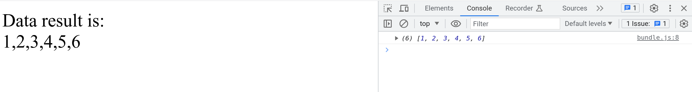

### Create a bundle

Will bundle all dependencies in single js file, exports will be handle in the html by: getData() object.
```bash
browserify main.js --standalone getData -o bundle.js
```

### Look the HTML

