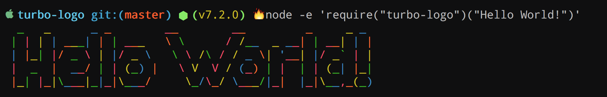
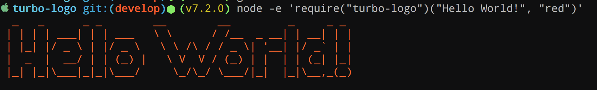
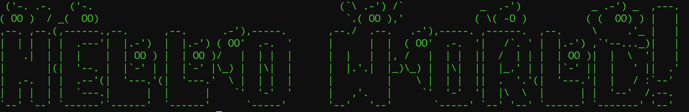

[](https://travis-ci.org/labs-js/turbo-logo)
[](https://codecov.io/gh/labs-js/turbo-logo)
[](https://www.npmjs.com/package/turbo-logo)
[](https://github.com/labs-js/turbo-git/blob/master/CONVENTION.md)
[](https://www.bithound.io/github/labs-js/turbo-logo)
[](https://codeclimate.com/github/labs-js/turbo-logo)

# turbo-logo

A simple ASCII art logo maker for the Terminal

## Install

```
npm install turbo-logo
```

## How to Use


```javascript
    var turboLogo = require('turbo-logo');

    turboLogo('Hello World!!')
```

### One line terminal test:

```bash
node -e 'require("turbo-logo")("Hello World!")'
```

## What do I get?



## Can I change the colors?

Of course..

```bash
node -e 'require("turbo-logo")("Hello World!", "red")'
```



Avialables colors: `red`,`green`,`yellow`,`blue`,`white`,`magenta`, `cyan`, `grey` , `gray` & `black`


## Can I change the font?

Pff.. yeah

```bash
node -e 'require("turbo-logo")("Hello World!", "red", { "font": "Ghost" })'
```


## More is comming...
